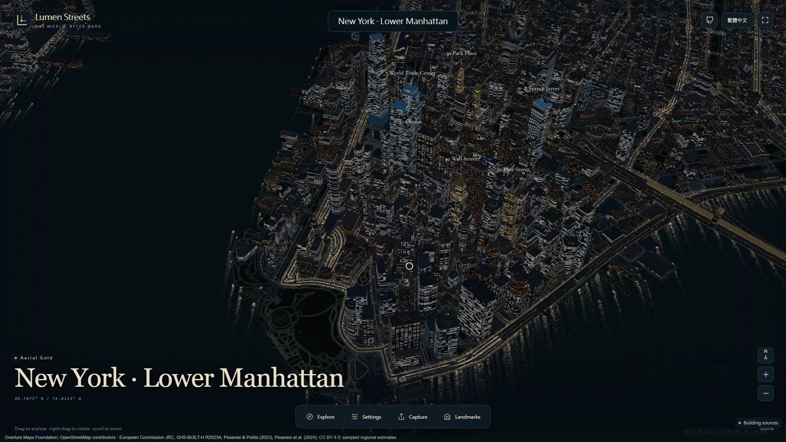
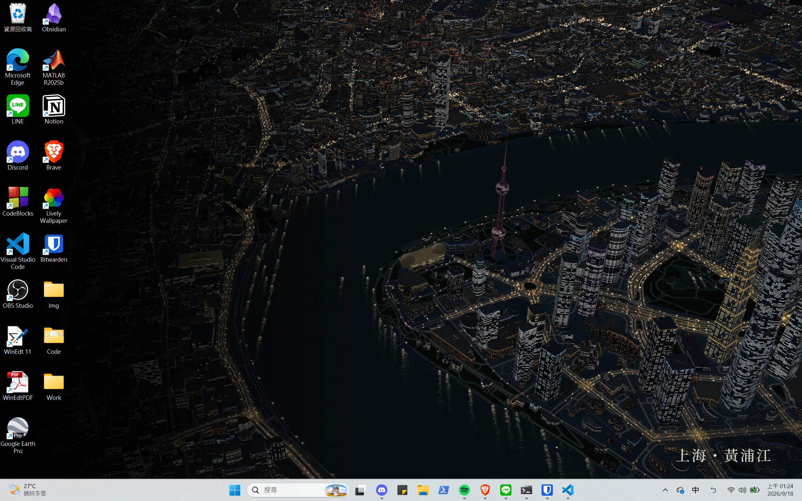

#  Lumen Streets

**Turn a city you love into a living nightscape wallpaper.**

Explore in 3D, follow the moving lights and frame a view for your screen.

[**Try it online**](https://lumenstreets.feifeihome.com/) · [**Gallery**](https://lumenstreets.feifeihome.com/gallery.html) · [Documentation](docs/README.md) · [繁體中文](README.zh-TW.md)


*Rendered in Lumen Streets. Map data © [OpenStreetMap contributors](https://www.openstreetmap.org/copyright) and [Overture Maps](https://docs.overturemaps.org/attribution/); height-source credits are listed in [Attribution](ATTRIBUTION.md).*

## Make it your night

- **Explore in 3D.** Start with a featured city or search for a favourite place. Pan, tilt and rotate to find your view.
- **Watch the streets move.** Simulated traffic brings the nightscape to life, from busy avenues to quiet waterfronts.
- **Frame your wallpaper.** Choose a screen ratio, add a place title and shade an edge to make room for desktop icons. Export a still image or animation.
- **Save and share.** Keep your view and traffic in a scene file, send a view link, or embed a nightscape on a website.

## From city to wallpaper in 40 seconds

[](https://lumenstreets.feifeihome.com/gallery.html#walkthrough)

## On your desktop

[](docs/images/shanghai-desktop.png)

*Shanghai · Huangpu River on a Windows desktop. [Download a 4K wallpaper](public/gallery/shanghai-wallpaper.png) or [explore the featured cities](docs/SHOWCASE.md).*

See the [wallpaper guide](https://lumenstreets.feifeihome.com/wallpapers.html) for setup and [export options](docs/EXPORTS.md) for formats and sizes.

## Run locally

Install **Git**, **Node.js 24** and **Python 3.12** with pip and venv, then:

```sh
git clone https://github.com/Gway0521/lumen-streets.git
cd lumen-streets
npm ci
npm run dev
```

Open **http://127.0.0.1:5180/**. The first start prepares an isolated Python environment for building data. To host your own instance, follow [Hosting](docs/HOSTING.md).

Visitors need a WebGL2-capable browser and internet access. Building heights may be estimated; lights and traffic are artistic simulations. See [browser compatibility](docs/COMPATIBILITY.md) and [building data](docs/BUILDING-HEIGHTS.md).

## Documentation and contributing

[Documentation](docs/README.md) covers wallpaper setup, saved scenes, hosting and development. Bug reports, translations and landmark models are welcome; start with [Contributing](CONTRIBUTING.md). Changes are listed in the [v0.3.0 release notes](docs/releases/v0.3.0.md).

## License

Code: [AGPL-3.0-only](LICENSE). OpenStreetMap data: [ODbL](https://www.openstreetmap.org/copyright). Keep source credits with publicly shared exports; see [Attribution](ATTRIBUTION.md).
