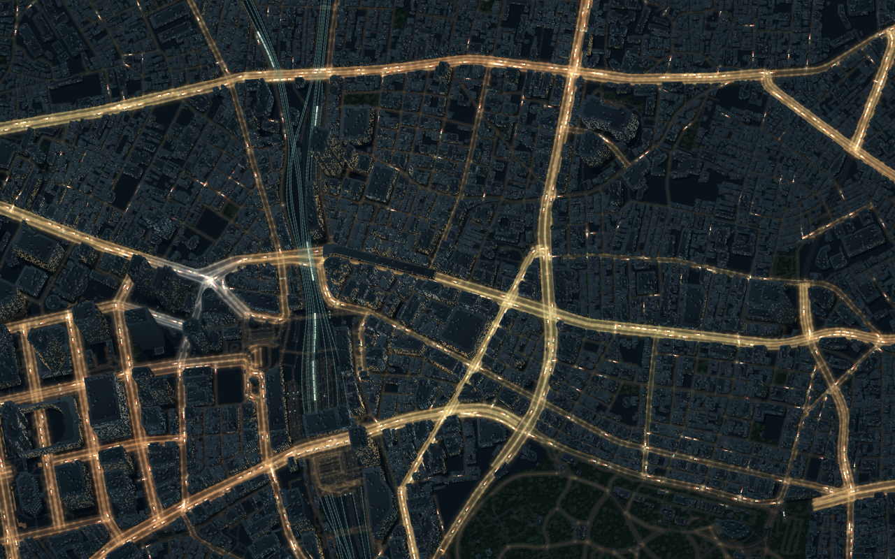
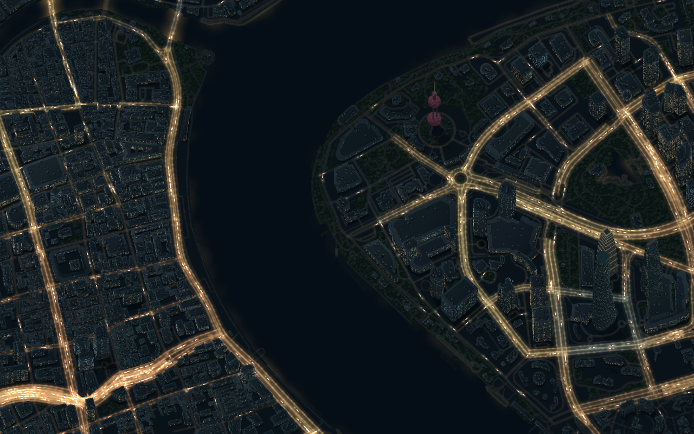

#  Lumen Streets

> **3D development preview:** this branch adds a WebGL 2 edition with global streaming, an orbiting camera, GPU window lights, the original traffic simulation and six landmark models. Run `npm ci` followed by `npm run dev:3d`, then open **http://127.0.0.1:5183/three.html**. See the [3D guide and current limits](docs/3D-ARCHITECTURE.md), [landmark import guide](docs/3D-LANDMARKS.md) and [3D roadmap](docs/3D-ROADMAP.md). The documentation below describes the preserved **classic 2D editor**; the public demo remains the classic edition.

**Turn real streets into living nightscapes.**

Lumen Streets turns OpenStreetMap streets, buildings and railways into animated nightscapes in your browser. Choose a place, adjust the lighting and export a still or video wallpaper.

[**Try it online**](https://lumenstreets.feifeihome.com/) · [繁體中文](README.zh-TW.md) · [Get started](#get-started) · [Wallpapers](docs/EXPORTS.md) · [Contributing](CONTRIBUTING.md)


*Sapporo, drawn from OpenStreetMap. Cover animation from an actual video export. Map data © [OpenStreetMap contributors](https://www.openstreetmap.org/copyright), ODbL.*

## Make it your night

- **Start with eight places, or find your own.** Explore Sapporo, Tokyo, Taipei, Shanghai, Beijing, Seattle and Washington, DC, or search for another neighbourhood. The eight included maps need no account or API key.
- **Buildings with depth.** Aerial Gold adds shaded facades, rooftops and shore reflections in a north-facing aerial view. Six landmark models include Taipei 101, Sapporo TV Tower and Shanghai's four signature towers. Amber and Blue hour offer flat illustration styles.
- **Made for your desktop.** 4K PNGs and 1080p/1440p videos, in desktop or portrait framing. Add a place title, show landmarks, or softly dim an edge for icons. Exports have no branding by default.
- **A scene you can return to.** Save the exact view and traffic moment in a scene file, or share a player link and embed it in a website.

| Tokyo · Shinjuku | Shanghai · The Bund |
| --- | --- |
|  |  |

*Actual exports. Map data © [OpenStreetMap contributors](https://www.openstreetmap.org/copyright), ODbL.*

[What's new in v0.2.0](docs/releases/v0.2.0.md): building depth, six landmark models, updated scene sharing and full-display wallpaper sizing.

## Get started

[Open Lumen Streets](https://lumenstreets.feifeihome.com/) in your browser. Choose a place, adjust the light and export a wallpaper.

### Run locally

Install [Node.js 24](https://nodejs.org/), download or clone this repository, and run:

```sh
npm ci
npm run dev
```

Open **http://127.0.0.1:5180/**. Choose a place, open **Adjust** to shape the light, then **Export** to frame and save it. **Hide controls** leaves just the nightscape; Escape brings the controls back.

**Find a place** searches for a neighbourhood and loads a 1, 2 or 4 km area. The included server provides search in development and production. Public map services have usage limits; see [search configuration](docs/PROVIDERS.md).

## Put it on your desktop

Choose PNG for a still wallpaper, or MP4 for a video wallpaper in an app such as [Lively](https://github.com/rocksdanister/lively). Videos run from 15 seconds to five minutes; GIF creates a short sharing preview. The app checks which formats your browser can create.

For icons or a clock, open **Room for icons** in Export and dim one edge. Drag the crop to keep your favourite streets in view. Captions and landmark names are optional.

See [export formats and setup](docs/EXPORTS.md) and [scene sharing](docs/SCENES.md). Videos repeat with a cut at the end.

## Self-hosting

```sh
npm run build
npm start
```

Stop the dev server before starting the production server on port 5180. `npm start` serves the website and search together. See [Hosting](docs/HOSTING.md) for domain settings and an uploadable build. You can also serve `dist/` on a static host to use the included maps and scene files, with search hidden.

The renderer uses Canvas 2D, with one scene engine shared by the editor, exports and player. Map data loads one area at a time; there is no account system or analytics.

## Contributing

Bug reports, translations and examples of difficult street layouts are welcome. Start with [Contributing](CONTRIBUTING.md), [Architecture](docs/ARCHITECTURE.md) or the [Roadmap](docs/ROADMAP.md). Check [browser compatibility](docs/COMPATIBILITY.md) for current limits.

## License

Code: [AGPL-3.0-only](LICENSE). Map data: [OpenStreetMap](https://www.openstreetmap.org/copyright), ODbL. When sharing an export publicly, include map credit and its license link; the export dialog can add it to the image. Full details are in [Attribution](ATTRIBUTION.md).

Buildings combine mapped heights, conservative estimates and original landmark artwork. Lighting, traffic and trains are artistic simulations, not live observations. See [Buildings](docs/BUILDINGS.md) for source and model details.
