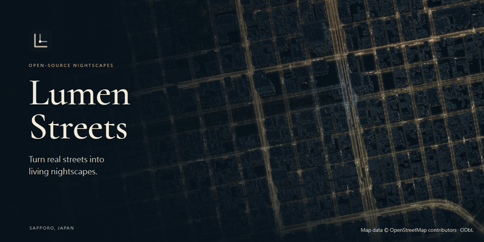

#  Lumen Streets

**探索入夜後的城市。**

Lumen Streets 將 OpenStreetMap 的街道與建築轉為可以平移、旋轉與俯瞰的 3D 夜景。選擇地點、調整光線、構圖，再匯出桌布。

[**公開展示**](https://lumenstreets.feifeihome.com/) · [English](README.md) · [架構](docs/3D-ARCHITECTURE.zh-TW.md) · [地標貢獻](docs/3D-LANDMARKS.zh-TW.md)

**目前為開發版本 0.3.0-dev.0，尚未正式發布 v0.3.0。** 此份原始碼已以 3D 編輯器為主；[v0.3.0 更新說明](docs/releases/v0.3.0.md)仍在整理，公開展示站可能使用不同版本。

## 做一幅自己的夜景

- **連續探索。** 全球向量地圖隨視角載入，支援平移、旋轉、傾斜與縮放；八個精選展示區兼顧城市與水岸，既有快照在原涵蓋範圍補充細節。
- **城市光影。** 多種建築立面、窗光、路燈、植被與風格化水面反射，以及 51 組地標模型。「設定」可開關地標名稱；詳見[展示區、清單與容量評估](docs/SHOWCASE.zh-TW.md)。
- **桌布構圖。** PNG 最長邊可達 3840 px；影片最長邊可達 2560 px；GIF 提供六秒預覽。支援桌面、超寬、平板、手機與自訂比例，以及標題、地標名稱與柔和邊緣壓暗。
- **保存與分享。** 場景檔保留視角、構圖與車流；也可複製視角連結或嵌入程式碼。
- **地標貢獻。** 預覽本機 GLB，下載包含模型、定位、授權與預覽圖的 ZIP，供 GitHub 審查。

## 本機執行

安裝 Node.js 24，執行：

```sh
npm ci
npm run dev
```

開啟 **http://127.0.0.1:5180/**，使用探索、設定、匯出面板。拖曳平移、右鍵拖曳旋轉與傾斜、滾輪縮放；介面支援英文與繁體中文。

3D 繪圖需要 WebGL2 與線上向量圖磚，預設地點也需要連網。搜尋使用隨附的 Node 服務。詳見[相容性](docs/COMPATIBILITY.md)與[地圖服務](docs/PROVIDERS.md)。

## 匯出與舊版差異

PNG 為靜態桌布。影片優先採 MP4/AVC，不支援時嘗試 WebM/VP9；可選 30 秒至五分鐘。GIF 為六秒預覽，影片結尾以切換方式重播，並非無縫循環。詳見[匯出](docs/EXPORTS.md)及[場景與分享](docs/SCENES.md)。

3D 使用新的場景格式。舊 2D 場景檔與播放器連結仍可由舊播放器讀取，但不會自動轉成 3D；不再提供 2D 編輯器入口。舊版琥珀／藍調色盤、全區研究圖匯出與離線預設地圖不屬於新版編輯器功能。

## 自行部署

```sh
npm run build
npm start
```

先停止開發伺服器，再以 port 5180 啟動正式建置。Node 程序同時提供網站與搜尋；純靜態部署可使用線上圖磚繪圖與匯出，但沒有搜尋服務。詳見[部署說明](docs/HOSTING.zh-TW.md)。

MapLibre 與 Three.js 共用即時 3D 場景、匯出與嵌入繪圖；背景 worker 處理幾何，圖磚快取與 GPU 資源具有明確的預算與釋放流程。後續工作見[路線圖](docs/3D-ROADMAP.zh-TW.md)。

## 舊版作品



*此圖為 v0.2.0 Canvas 版本的歷史匯出，並非目前 3D 繪圖。地圖資料 © [OpenStreetMap 貢獻者](https://www.openstreetmap.org/copyright)，ODbL。既有[圖庫](public/gallery.html)與社群預覽圖也仍為 v0.2.0 作品。*

## 授權

程式採 [AGPL-3.0-only](LICENSE)，地圖資料採 ODbL。公開分享匯出作品時請保留可見的地圖署名，詳見[來源與授權](ATTRIBUTION.md)。

建築高度結合地圖數值與估算；光線、植被位置與交通皆為藝術模擬。本機匯入模型不會自動上傳，須由作者另行提交審查。

可選用[建築高度預處理](docs/BUILDING-HEIGHTS.zh-TW.md)，整合 Overture 與區域來源、保留原始缺值及來源，再按視野載入建築圖磚。專案提供建置工具，尚未內建或代管整合後的全球資料集。
