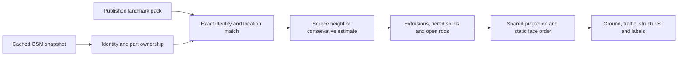

# Buildings and landmarks

Aerial Gold combines mapped footprints with source heights and original parametric artwork. Taipei 101 and Sapporo TV Tower have reviewed profiles; ordinary buildings use extrusion, and other mapped lattice towers receive a neutral open frame. Amber and Blue retain their flat illustration styles.

## Runtime pipeline



The runtime has no Wikidata, official-site or model-download requests. Geometry is prepared when an atlas is created, never during an animation frame. A portable scene embeds only its used landmark profiles, including their pack, generator and projection versions.

## Height resolution

1. A reviewed profile may override a particular landmark's height. Its decision record preserves conflicting source values.
2. A valid OSM `height` supplies the top elevation above ground. Metres and feet are parsed strictly; lists, partial numbers, negative values and values above the 1200 m sanity limit are rejected, not clamped.
3. `building:levels` estimates height at 3.2 m per storey, or 3.6 m for commercial/office/retail use, plus `roof:height` or an estimated `roof:levels` contribution. This is an estimate from mapped floors, not a surveyed measurement.
4. Missing or invalid data uses a conservative type/footprint estimate and a stable namespaced feature seed. Ordinary estimates remain at most 48 m. Generic towers use a restrained estimate rather than a landmark's silhouette.

`min_height` is the bottom elevation, with `building:min_level` as a fallback. It is not added to an explicit top height. Invalid bottom/top combinations fall back to another credible candidate or an estimate. Explicit heights already include roof height; roofs are not counted twice. Antenna/spire semantics require source review for landmarks.

Projection version 1 maps `(x,y,z)` to `(x-.32z,y-.48z)`, in local world metres. A common fixed scale preserves relative heights; footprint area and building type do not truncate valid measurements. Changing district light does not change geometry. The camera remains an artistic oblique view rather than a navigable 3D scene.

## Identity and structures

Source IDs retain their OSM namespaces. Multipolygon rings keep holes; building relations associate `outline` and `part` members. A spatial grid associates otherwise ungrouped parts only when one containing building can be identified without crossing a courtyard. Recognized outlines are not extruded over their parts. Incomplete parts may leave missing detail; the renderer does not invent a tall body to fill it. Ambiguous ownership remains separate.

Tower nodes can supply a small estimated footprint. Nodes with the same Wikidata identity inside an existing mapped structure are suppressed. Landmark matching requires an exact OSM or Wikidata identity **and** proximity to the reviewed anchor. Name fragments such as “Taipei 101 / MRT Exit 5” never select a tower model. A matching assembly is replaced once, including its identified parts.

The initial profiles are deliberately small:

| Landmark | Verified facts | Authored simplifications |
| --- | --- | --- |
| Taipei 101 | 508 m architectural total, 101 tower floors; source outline includes shopping podium | Separate tower anchor; low podium, eight flared sections, crown and spire; widths and intermediate elevations |
| Sapporo TV Tower | Official 144 m total and 90.38 m observatory; OSM/Wikidata 147.2 m conflict retained | Four splayed legs, X bracing, platforms, pale green observation enclosure and fixed illuminated clock marks |

The profiles use 21 solid parts plus one rod for Taipei 101, and five solids plus 65 rods for Sapporo. No third-party meshes, photographs or textures are included. Source references, revision IDs and distinctions between measurements and artwork live in [`sources-v1.json`](../data/landmarks/sources-v1.json).

## Maintaining a pack

```sh
npm run fetch:landmarks     # optional network batch, candidate facts only
npm run prepare:landmarks   # validate reviewed profiles and write their manifest
npm run check:landmarks     # read-only check; also runs during build
```

The fetch command retrieves the small curated list of Wikidata entities into ignored `.cache/landmarks/`. Its report retains revisions, units, qualifiers, references and disagreements with the published height. It cannot edit the runtime pack. Check official sources and OSM identity/parts before selecting a candidate; multiple heights may refer to different components.

Edit the reviewed runtime definitions in `src/buildings/landmarks-v1.json` and document decisions separately in `data/landmarks/`. The preparation command checks anchors against bundled map fixtures, source conflicts, model top height and geometry budgets, then writes a SHA-256 manifest. Review that diff and the actual close/whole-city renders. A new pack should use a new version/file and retain compatibility with embedded older profiles; bump the generator or projection version when their interpretation changes. Unsupported geometry versions are rejected rather than silently replaced.

This small pack is bundled with the app. Introduce geographic pack sharding or an indexed store only when catalogue size justifies it; no database is needed for two entries.

## Composition and limits

Solid faces and rods participate in the same static order. Overlapping projected polygons are compared by elevation along the viewing ray using a bounded spatial index and a stable topological order. Courtyard holes and spaces between rods retain alpha, so moving lights can remain visible through them. Projected shadows and label anchors use the same elevation convention.

Intersecting structures can create cycles; those use a deterministic painter fallback. This is not an arbitrary-mesh depth buffer. The ordering report records cycles and exhausted comparison budgets so dense/problematic fixtures can be inspected rather than assuming all intersections are solved.

The structure atlas has its own projected bounds, preserving tall silhouettes at geographic edges. Both atlas long edges remain capped at 3600 pixels; extension may slightly reduce structure resolution. No extra persistent full-size canvas was added to the previous two-atlas architecture. Each maximum-size RGBA atlas is approximately 49.5 MiB, before browser overhead; a capture owns another pair. Roof equipment and facade rows are bounded, and the same detail is used by preview, saved scenes and exports. Physical-phone validation remains distinct from desktop viewport tests.

Run `scripts/check-landmark-browser.mjs` for close/wide output, open-structure alpha, file restoration, reference settings, capture equality and timings. See [Testing](TESTING.md) for the complete browser matrix and [Scenes](SCENES.md) for migration behavior.
