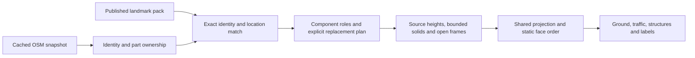

# Buildings and landmarks

For the current 3D editor's prepared source system, see [Building height data](BUILDING-HEIGHTS.md). The fixed projection, six-profile pack and Canvas details below describe the retained legacy renderer; the 3D showcase has its own catalog.

Aerial Gold combines mapped footprints with source heights and original parametric artwork. Six reviewed profiles cover Taipei 101, Sapporo TV Tower, Oriental Pearl Tower, Shanghai Tower, Shanghai World Financial Center and Jin Mao Tower. Ordinary buildings use extrusion; mapped lattice towers receive a neutral open frame. Amber and Blue retain their flat illustration styles.

## Runtime pipeline



The runtime has no Wikidata, official-site or model-download requests. Geometry is prepared when an atlas is created, never during an animation frame. A portable scene embeds only its used landmark profiles, including their pack, generator and projection versions.

## Height resolution

1. A reviewed profile may override a particular landmark's height. Its decision record preserves conflicting source values.
2. A valid OSM `height` supplies the top elevation above ground. Metres and feet are parsed strictly; lists, partial numbers, negative values and values above the 1200 m sanity limit are rejected.
3. `building:levels` estimates height at 3.2 m per storey, or 3.6 m for commercial/office/retail use, plus `roof:height` or an estimated `roof:levels` contribution. This is an estimate from mapped floors, not a surveyed measurement.
4. Missing or invalid data uses a conservative type/footprint estimate and a stable namespaced feature seed. Ordinary estimates remain at most 48 m. Generic towers use a restrained estimate rather than a landmark's silhouette.

`min_height` is the bottom elevation, with `building:min_level` as a fallback. It is not added to an explicit top height. Invalid bottom/top combinations fall back to another credible candidate or an estimate. Explicit heights already include roof height; roofs are not counted twice. Antenna/spire semantics require source review for landmarks.

Projection version 1 retains `(x,y,z) → (x-.32z,y-.48z)` for aerial-7 scenes. Version 2 uses a fixed orthographic camera, initially 70 degrees above the horizontal. New recipes set `azimuth: 0` so roofs rise straight north on screen. Azimuth is clockwise from north (0–360 degrees); older recipes without it retain their northwest direction. `engine/projection.js` supplies a shared ground transform and compatible height displacement; world metres and measured heights remain unchanged. Ground, solids, frames, shadows, traffic and labels use the same camera. Pointer and crop operations use its inverse. The elevation is embedded in the recipe (bounded 55–85 degrees); the editor does not rebuild the city continuously for free rotation.

## Identity and structures

Source IDs retain their OSM namespaces. Multipolygon rings keep holes; building relations associate `outline` and `part` members. A spatial grid associates otherwise ungrouped parts only when one containing building can be identified without crossing a courtyard. Recognized outlines are not extruded over their parts. Incomplete parts may leave missing detail; the renderer does not invent a tall body to fill it. Ambiguous ownership remains separate.

Tower nodes can supply a small estimated footprint. Nodes with the same Wikidata identity inside an existing mapped structure are suppressed. Landmark matching requires an exact OSM or Wikidata identity **and** proximity to the reviewed anchor. Name fragments such as “Taipei 101 / MRT Exit 5” never select a tower model.

Generator version 2 assembles identity before discarding outline geometry. Selected structural tags can inform untagged parts, but total height and facade material are not blindly inherited. A known lattice assembly gets one frame; elevated platforms and annexes retain their own height semantics. A communications-tower use tag alone does not imply lattice construction.

Each reviewed profile lists exact `replace.sources`, explicit `replace.keep` exclusions and a `partsWithin` radius in metres. Additional parts are replaced only in the matched assembly and wholly inside that envelope; annexes are retained. Outlying or ambiguous parts remain available. The maintenance manifest records actual replaced/retained source IDs for every fixture. A matching outline's identity survives its geometry replacement. Legacy generator version 1 retains its original whole-assembly replacement behavior.

The bundled profiles use these measurements and simplifications:

| Landmark | Verified facts | Authored simplifications |
| --- | --- | --- |
| Taipei 101 | 508 m architectural total, 101 tower floors; source outline includes shopping podium | Separate tower anchor; low podium, eight flared sections, crown and spire; widths and intermediate elevations |
| Sapporo TV Tower | Official 144 m total and 90.38 m observatory; OSM/Wikidata 147.2 m conflict retained | Four splayed legs, X bracing, platforms, pale green observation enclosure and fixed illuminated clock marks |
| Oriental Pearl Tower | Official 468 m total; bundled outline has no height | Inclined legs, three open columns, two principal spheres, upper capsule and antenna; secondary spheres omitted |
| Shanghai Tower | 632 m; design describes 120-degree rotation | Rounded triangular sections taper and rotate; simplified envelope rather than double facade |
| Shanghai World Financial Center | Official 492 m total | Tapered body, two piers and a lintel forming an actual open sky portal |
| Jin Mao Tower | Owner's 420.5 m total; agrees with OSM | Repeated setbacks, restrained cornices and tapering crown |

The Shanghai profiles combine capped section lofts, ellipsoids and beams. Loft sections contain `[z, width, depth, rotation, x, y]` in local metres/degrees. Geometry becomes physical triangles with surface normals and ray heights; glass, silver, stone, rose, ivory and steel have distinct restrained shading. Triangles participate in the same order as generic buildings and open rods. No third-party meshes, photographs or textures are included. Source references and measurement/art distinctions live in [`sources-v1.json`](../data/landmarks/sources-v1.json) and [`sources-v2.json`](../data/landmarks/sources-v2.json).

## Maintaining a pack

```sh
npm run fetch:landmarks     # optional network batch, candidate facts only
npm run prepare:landmarks   # validate reviewed profiles and write their manifest
npm run check:landmarks     # read-only check; also runs during build
```

The fetch command retrieves the small curated list of Wikidata entities into ignored `.cache/landmarks/`. Its report retains revisions, units, qualifiers, references and disagreements with the published height. It cannot edit the runtime pack. Check official sources and OSM identity/parts before selecting a candidate; multiple heights may refer to different components.

Maintain definitions in `src/buildings/landmarks-v2.json` and document decisions separately in `data/landmarks/`; version 1 remains archived for compatibility. Preparation checks anchors, source conflicts, top heights, replacement bindings and geometry budgets, then writes SHA-256 manifests. Review the diff and actual close/whole-city renders. Once published, a pack version and its generator/projection/material interpretation are immutable: introduce a new version/file and keep the old path. Compact links verify the published pack hash. Full files embed the used definitions. Unsupported versions are rejected rather than silently substituted.

Imports allow at most 16 profiles, 40 components per profile, 24 sections per loft, 6000 estimated triangles per component profile and 24000 per scene. Parameters and material names are allowlisted; no model URLs, scripts or unbounded tessellation are accepted.

## Composition and limits

Solid faces and rods participate in the same static order. Overlapping projected polygons are compared by elevation along the viewing ray using a bounded spatial index and a stable topological order. Courtyard holes and spaces between rods retain alpha, so moving lights can remain visible through them. Projected shadows and label anchors use the same elevation convention.

Intersecting structures can create cycles; those use a deterministic painter fallback. This is not an arbitrary-mesh depth buffer. The ordering report records cycles and exhausted comparison budgets so dense/problematic fixtures can be inspected rather than assuming all intersections are solved.

The structure atlas has its own projected bounds, preserving tall silhouettes at geographic edges. Both atlas long edges remain capped at 3600 pixels; extension may slightly reduce structure resolution. The fixed projection is baked once into each atlas, releasing its unprojected surface after conversion. The renderer retains two atlases. Each maximum-size RGBA atlas is approximately 49.5 MiB, before browser overhead; a capture owns another pair. Roof equipment and facade rows are bounded, and the same detail is used by preview, saved scenes and exports. Physical-phone validation remains distinct from desktop viewport tests.

Run `scripts/check-projection-browser.mjs` for portal transparency, Shanghai/Taipei/Sapporo/Tokyo output, file/link restoration, capture equality and timings. `QA_BASELINE` optionally selects an independently archived aerial-7 source directory for exact legacy comparisons. `scripts/check-landmark-browser.mjs` retains the close/wide tower studies. See [Testing](TESTING.md) and [Scenes](SCENES.md).
