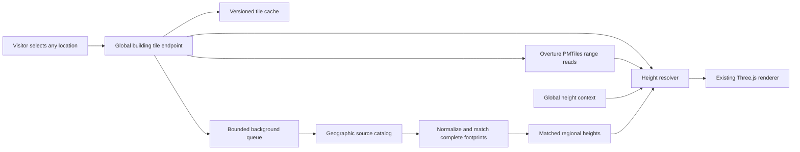

# Global building service

Status: implemented as the default development, preview and Node deployment path. The service replaces the former city-by-city manifest configuration. The retained offline tool is documented in [Building heights](BUILDING-HEIGHTS.md).

The product must let a visitor navigate to their hometown and receive the same height-processing pipeline without uploading data, running Python, selecting a source or asking an operator to add a city. Coverage of high-quality measurements varies; eligibility for the pipeline must not vary by an operator-maintained city list.

## Decision

Use Overture's existing global PMTiles as the default building source. Add a tile-scoped resolver and persistent cache to the existing Node service. Use a separate background geospatial worker for expensive regional source ingestion and matching. Keep the existing Three.js facade renderer and the existing road/water/traffic sources.

Do not make a private list of prepared regions the gateway to improved heights. Do not run the current GeoParquet/CityGML batch builder synchronously for every browser tile. Reuse already tiled global data; do heavy source integration outside the request path.

## Comparable implementations

| Project | Verified behavior | Consequence for Lumen Streets |
| --- | --- | --- |
| [Overture Explorer / PMTiles](https://docs.overturemaps.org/examples/overture-tiles/) | Publishes global MVT archives with each release. The current [building profile](https://github.com/OvertureMaps/overture-tiles/blob/main/profiles/Buildings.java) adds full attributes at z14. The tiles are inspection data rather than a finished cartographic basemap. | Global source delivery already exists. Adapt and trim its attributes instead of building every source tile again. |
| [Re:Earth Buildings](https://github.com/reearth/reearth-buildings) | Reads Overture PMTiles by HTTP Range, generates 3D Tiles on demand and caches output. Missing heights use floors, class, subtype, footprint and density heuristics. | Adopt demand-driven generation and caching. Its global coverage is not a global inventory of measured heights. Its GLB output is not a drop-in replacement for the current facade mesh. |
| [VoxCity](https://github.com/kunifujiwara/VoxCity) | Selects sources geographically and processes a requested area in Python. Multiple sources need Earth Engine setup. Its pipeline also contains a final estimated-height fallback. | Reuse the geographic selection pattern in a server worker. Visitors must not inherit its research-environment setup or download workflow. |
| [Cesium OSM Buildings](https://cesium.com/platform/cesium-ion/content/cesium-osm-buildings/) | Streams global 3D Tiles; estimated height may use three metres per floor and a minimum of one floor. | Global availability and measured-height completeness are separate properties. Switching renderers alone does not solve missing data. |

Re:Earth source reviewed at `08ebf1c42912af081c0b9751f3df6ec40e611c12`; VoxCity at `fa212656305328a9a657973bae26f352bfe813bc`. Their implementations may change after review.

## Live source feasibility

Read one z14 tile at each of five coordinates from the official `2026-08-19.0/buildings.pmtiles` archive, without preparing any region. Every response contained building geometry, string source identities, source attribution and nullable height/floor fields. Both `building` and `building_part` layers were available. `sources` is JSON encoded in the MVT and must be decoded with limits.

| Sample | Building features | Explicit heights on buildings | Building parts |
| --- | ---: | ---: | ---: |
| Kaohsiung | 797 | 4 | 7 |
| Nairobi | 4,661 | 45 | 48 |
| Sao Paulo | 10,927 | 10,106 | 251 |
| Accra | 9,067 | 1 | 2 |
| Kumamoto | 6,039 | 3 | 2 |

These are individual clipped tile samples, not city-wide accuracy or coverage statistics. The five tile reads plus shared metadata/index reads transferred 2,350,351 bytes in 12 HTTP Range requests. Decoded individual tile sizes ranged from 105,051 to 3,590,475 bytes. The server returned HTTP 206 and CORS `*`; its complete archive size was 180,364,329,147 bytes. No complete archive was downloaded. This establishes source access, not full-viewport latency, mobile memory usage or production service reliability.

The huge difference between Sao Paulo and Accra also demonstrates why merely changing the source URL cannot provide complete measured heights.

## Height selection

Every location uses the same resolver and preserves input nulls independently of the chosen display height:

1. Compatible mapped/surveyed heights from Overture or a matched regional source, ranked using definition, match and observation date.
2. Available floor counts, with explicit conversion assumptions.
3. Fine-resolution height estimates where their data actually covers the footprint.
4. Global coarse height context and qualified local statistics, with effective resolution and estimate status preserved.
5. Deterministic class/use/footprint fallback when no evidence is available. Density is supporting context, not a universal rule that urban buildings must be towers.

[GHS-BUILT-H](https://human-settlement.emergency.copernicus.eu/ghs_buH2023.php) supplies the first automatic global context layer: official ANBH 100 m Mollweide tiles, 2018 reference data, R2023A. The worker discovers published 1,000 km tile archives, downloads only intersecting cells, validates their ZIP contents and samples valid pixel support over each footprint. It labels these values `regional` / `cell_mean` with the effective 100 m resolution, never individual measurements. [Reuse terms and citations](https://human-settlement.emergency.copernicus.eu/GHSLhowToCite.php) accompany the data.

Keep PLATEAU, EUBUCCO, 3DBAG and other reviewed sources in a geographic catalog with data coverage, releases, access mechanism, license, CRS and height definition. Coverage indexes are dataset metadata, not manually maintained showcase lists. The worker discovers the relevant source partitions and caches successful normalized extracts. Unsupported or restricted inputs must have a recorded reason.

[GBA distinguishes ODbL footprints from CC BY-NC heights/LoD1](https://github.com/zhu-xlab/GlobalBuildingAtlas). Its height data is not the unrestricted default. A downstream conversion does not remove the upstream height license. Google 2.5D and UT-GLOBUS have geographic limits; neither substitutes for a worldwide fallback. See the [source review](BUILDING-HEIGHTS.md#data-review-and-licensing).

## Request and update behavior

- A global tile request always enters the new pipeline, including a location never visited before. Missing cache entries trigger bounded source reads and resolution automatically. Ocean/no-building tiles are valid empty results.
- Regional matching runs on fixed z14 blocks with a halo and reassembled full Overture footprints. Background requests are coalesced across visitors. A moving camera must not enqueue an unlimited number of national downloads.
- The fast response can use global evidence and estimates while a regional job runs. Publish the improved result atomically, then refresh an idle viewport. Never label an estimated result as surveyed or a pending enrichment as complete.
- Distinguish `pending`, `complete`, `no-coverage`, `failed` and `deferred` source status. Apply provider timeouts/backoff and negative-cache expiry. A source outage must not erase a valid cached scene or turn into an unmarked 5 m default.
- Store global-source release, resolver version, regional-source revision, selected method and uncertainty/provenance in the result. Validate a new source release before activation, with rollback available.
- Freeze the scene's chosen geometry and revisions for each export. Background enrichment must not change heights halfway through a video. Show current data quality in a concise source disclosure, with no required source-selection workflow.

## Geometry and resource constraints

The current prepared tiles contain complete repeated footprints; Overture MVT contains clipped fragments. The adapter must preserve or reassemble all fragments by string GERS identity. The existing whole-feature ID deduplication must not drop a neighbouring fragment. Tile clipping edges must not become false facade walls. Parts, parent outlines, courtyards and partial-height volumes require explicit handling.

Keep source reads and decoded buffers bounded, with request cancellation and one scene build in flight. The online service disables extract-dependent neighbourhood statistics; GHS and deterministic class/area fallback are independent of viewport order. Reuse one height definition/selection specification between the fast resolver and the Python worker, tested with shared fixtures.

Start with the existing Node deployment plus one managed geospatial worker and a quota-limited persistent cache. CDN/object storage can be added for traffic growth; Cloudflare-specific infrastructure is not required for the first implementation. Setup belongs to the site's deployment, not to each visitor or city. A static-only site can use the same global tile service; any reduced-capability fallback must be documented explicitly.

No monthly operating-cost or first-visit latency promise is established by the five-tile probe. Measure cold/warm full viewports, source downloads, decoded memory and cache growth before setting production budgets.

## Runtime and resource limits

`server/buildings/` owns global range reads, fragment assembly, request coalescing, disk caches and two background job lanes. `scripts/buildings/enrich.py` applies global context first; a separate national lane performs geographic discovery and matching. Same-key requests share one job. The result and audit are written before their completed metadata becomes visible. Terminal results live on disk rather than accumulating decoded building arrays in memory.

- Two tile assembly jobs at once; at most 32 waiting; eight upstream range requests; each range/source tile and each browser response bounded to 8 MiB.
- Complete-footprint assembly follows at most 25 neighbouring tiles. Pathological geometry fails explicitly. Stable GERS strings are used instead of unsafe numeric MVT feature IDs.
- Context and national lanes each run one process, queue at most 96 jobs, and stop a job after 120/300 seconds. Deferred work retries when the view refreshes. Partial failure backs off one hour; completed/no-data results expire after seven days. A pinned Overture release and resolver version namespace cache entries.
- Persistent cache budgets: 512 MiB source MVT, 256 MiB results, 512 MiB inputs/audits, 2 GiB downloads/extracted rasters, with temporary active work additional. Pruning touches only generated filenames under owned cache directories. Direct downloads have 512 MiB per-job budgets; DuckDB range traffic is separate.
- Background jobs accept only server-produced tile inputs. Fixed source hosts and redirect validation prevent arbitrary URL requests. HTTP accepts validated z14 tile coordinates, same-origin requests and bounded client concurrency/rates.
- The browser retains its 4/2 request concurrency and 24/8 MiB encoded cache. Dictionary JSON removes repeated property keys; it does not erase source nulls. Pending views revalidate every 30 seconds while idle. Exports freeze geometry and attribution together.

PLATEAU and EUBUCCO have automatic remote adapters. 3DBAG and other inputs currently require reviewed local adapters; Taiwan national data is not claimed as integrated. Global GHS/Overture processing remains available outside national coverage. Neither a source's global footprint coverage nor a completed background job proves a real height for every building.

The runtime needs a Node 24 host, Python 3.12 and persistent cache space; the browser remains lightweight. `npm dev/start/preview` prepares the shared environment before listening. See [Hosting](HOSTING.md). No paid infrastructure, database or GPU is required by the implementation. Public upstream availability and production operating cost remain deployment concerns.

## Validation

Automated tests cover shared fast/background height fixtures, real 5 m versus missing values, compact tile round trips, courtyard preservation, multi-tile footprint assembly, source-host rejection, global coordinates, job coalescing, intermediate publication and persistent cache reuse. Live acceptance exercises locations without changing presets or preparing regional manifests, along with both interface languages, desktop/mobile browser views and exported images. These checks validate the pipeline and its resource limits, not the accuracy of every building in the world.

Live checks on 2026-09-17 used the default service with no prepared regional manifests. Single-tile results after background processing:

| Location | Source pieces | Regional GHS values | National values selected |
| --- | ---: | ---: | ---: |
| Kaohsiung, 85 Sky Tower tile | 803 | 783 | 0 |
| Nairobi | 4,693 | 4,455 | 0 |
| Accra | 13,000 | 9,576 | 0 |
| Sao Paulo | 11,085 | 743 | 0 |
| Kumamoto | 6,040 | 3,412 | 2,620 PLATEAU |
| Paris | 5,016 | 346 | 3,222 EUBUCCO |
| Rural Tasmania | 2 | 1 | 0 |
| Pacific Ocean | 0 | 0 | 0 |

Other values came from Overture or the marked fallback. These samples are not city-wide coverage rates. An unprepared Lima viewport first showed 14,303 fallback pieces; without navigation or manual reload, background GHS processing replaced them with regional estimates while 4,539 mapped values and 173 floor-derived values remained. Desktop/mobile bilingual views, PNG/GIF/video exports, capture cancellation and packaged Node-service requests were exercised separately.
