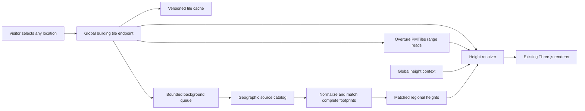

# Global building service design

Status: proposed architecture, supported by live source probes on 2026-09-17. The runtime has **not** been migrated to this design. The current regional preprocessing implementation is described in [Building heights](BUILDING-HEIGHTS.md).

The product must let a visitor navigate to their hometown and receive the same height-processing pipeline without uploading data, running Python, selecting a source or asking an operator to add a city. Coverage of high-quality measurements varies; eligibility for the pipeline must not vary by an operator-maintained city list.

## Decision

Use Overture's existing global PMTiles as the default building source. Add a tile-scoped resolver and persistent cache to the existing Node service. Use a separate background geospatial worker for expensive regional source ingestion and matching. Keep the existing Three.js facade renderer and the existing road/water/traffic sources.

Do not make a private list of prepared regions the gateway to improved heights. Do not run the current GeoParquet/CityGML batch builder synchronously for every browser tile. Reuse already tiled global data; do heavy source integration outside the request path.

## Comparable implementations

| Project | Verified behavior | Consequence for Lumen Streets |
| --- | --- | --- |
| [Overture Explorer / PMTiles](https://docs.overturemaps.org/examples/overture-tiles/) | Publishes global MVT archives with each release. The current [building profile](https://github.com/OvertureMaps/overture-tiles/blob/main/profiles/Buildings.java) adds full attributes at z14. The tiles are inspection data rather than a finished cartographic basemap. | Global source delivery already exists. Adapt and trim its attributes instead of building every source tile again. |
| [Re:Earth Buildings](https://github.com/reearth/reearth-buildings) | Reads Overture PMTiles by HTTP Range, generates 3D Tiles on demand and caches output. Missing heights use floors, class, subtype, footprint and density heuristics. | Adopt demand-driven generation and caching. Its global coverage is not a global inventory of measured heights. Its GLB output is not a drop-in replacement for the current facade mesh. |
| [VoxCity](https://github.com/kunifujiwara/VoxCity) | Selects sources geographically and processes a requested area in Python. Multiple sources need Earth Engine setup. Its pipeline also contains a final estimated-height fallback. | Reuse the geographic selection pattern in a server worker. Visitors must not inherit its research-environment setup or download workflow. |
| [Cesium OSM Buildings](https://cesium.com/platform/cesium-ion/content/cesium-osm-buildings/) | Streams global 3D Tiles; estimated height may use three metres per floor and a minimum of one floor. | Global availability and measured-height completeness are separate properties. Switching renderers alone does not solve missing data. |

Re:Earth source reviewed at `08ebf1c42912af081c0b9751f3df6ec40e611c12`; VoxCity at `fa212656305328a9a657973bae26f352bfe813bc`. Their implementations may change after review.

## Live source feasibility

Read one z14 tile at each of five coordinates from the official `2026-08-19.0/buildings.pmtiles` archive, without preparing any region. Every response contained building geometry, string source identities, source attribution and nullable height/floor fields. Both `building` and `building_part` layers were available. `sources` is JSON encoded in the MVT and must be decoded with limits.

| Sample | Building features | Explicit heights on buildings | Building parts |
| --- | ---: | ---: | ---: |
| Kaohsiung | 797 | 4 | 7 |
| Nairobi | 4,661 | 45 | 48 |
| Sao Paulo | 10,927 | 10,106 | 251 |
| Accra | 9,067 | 1 | 2 |
| Kumamoto | 6,039 | 3 | 2 |

These are individual clipped tile samples, not city-wide accuracy or coverage statistics. The five tile reads plus shared metadata/index reads transferred 2,350,351 bytes in 12 HTTP Range requests. Decoded individual tile sizes ranged from 105,051 to 3,590,475 bytes. The server returned HTTP 206 and CORS `*`; its complete archive size was 180,364,329,147 bytes. No complete archive was downloaded. This establishes source access, not full-viewport latency, mobile memory usage or production service reliability.

The huge difference between Sao Paulo and Accra also demonstrates why merely changing the source URL cannot provide complete measured heights.

## Height selection

Every location uses the same resolver and preserves input nulls independently of the chosen display height:

1. Compatible mapped/surveyed heights from Overture or a matched regional source, ranked using definition, match and observation date.
2. Available floor counts, with explicit conversion assumptions.
3. Fine-resolution height estimates where their data actually covers the footprint.
4. Global coarse height context and qualified local statistics, with effective resolution and estimate status preserved.
5. Deterministic class/use/footprint fallback when no evidence is available. Density is supporting context, not a universal rule that urban buildings must be towers.

Use [GHS-BUILT-H](https://human-settlement.emergency.copernicus.eu/ghs_buH2023.php) as the first global context candidate: 2018 reference data at 100 m / 3 arcsec. Its [CC BY 4.0 terms and required citations](https://human-settlement.emergency.copernicus.eu/GHSLhowToCite.php) permit reuse with attribution. Its grid values must remain regional estimates, not individual building measurements. Automated catalog access, serving format, cold-fetch time and storage still need an implementation spike; no global raster service was verified in this review.

Keep PLATEAU, EUBUCCO, 3DBAG and other reviewed sources in a geographic catalog with data coverage, releases, access mechanism, license, CRS and height definition. Coverage indexes are dataset metadata, not manually maintained showcase lists. The worker discovers the relevant source partitions and caches successful normalized extracts. Unsupported or restricted inputs must have a recorded reason.

[GBA distinguishes ODbL footprints from CC BY-NC heights/LoD1](https://github.com/zhu-xlab/GlobalBuildingAtlas). Its height data is not the unrestricted default. A downstream conversion does not remove the upstream height license. Google 2.5D and UT-GLOBUS have geographic limits; neither substitutes for a worldwide fallback. See the [source review](BUILDING-HEIGHTS.md#data-review-and-licensing).

## Request and update behavior

- A global tile request always enters the new pipeline, including a location never visited before. Missing cache entries trigger bounded source reads and resolution automatically. Ocean/no-building tiles are valid empty results.
- Regional matching runs on stable geographic blocks with a halo and complete GeoParquet footprints. Background requests are coalesced across visitors. A moving camera must not enqueue an unlimited number of national downloads.
- The fast response can use global evidence and estimates while a regional job runs. Publish the improved result atomically, then refresh an idle viewport. Never label an estimated result as surveyed or a pending enrichment as complete.
- Distinguish `pending`, `complete`, `no-coverage`, `failed` and `deferred` source status. Apply provider timeouts/backoff and negative-cache expiry. A source outage must not erase a valid cached scene or turn into an unmarked 5 m default.
- Store global-source release, resolver version, regional-source revision, selected method and uncertainty/provenance in the result. Validate a new source release before activation, with rollback available.
- Freeze the scene's chosen geometry and revisions for each export. Background enrichment must not change heights halfway through a video. Show current data quality in a concise source disclosure, with no required source-selection workflow.

## Geometry and resource constraints

The current prepared tiles contain complete repeated footprints; Overture MVT contains clipped fragments. The adapter must preserve or reassemble all fragments by string GERS identity. The existing whole-feature ID deduplication must not drop a neighbouring fragment. Tile clipping edges must not become false facade walls. Parts, parent outlines, courtyards and partial-height volumes require explicit handling.

Keep source reads and decoded buffers bounded, with request cancellation and one scene build in flight. Use fixed tile/block coordinates for deterministic statistics; viewport size and camera order must not change a building's height. Reuse one height definition/selection specification between the fast resolver and the Python worker, tested with shared fixtures.

Start with the existing Node deployment plus one managed geospatial worker and a quota-limited persistent cache. CDN/object storage can be added for traffic growth; Cloudflare-specific infrastructure is not required for the first implementation. Setup belongs to the site's deployment, not to each visitor or city. A static-only site can use the same global tile service; any reduced-capability fallback must be documented explicitly.

No monthly operating-cost or first-visit latency promise is established by the five-tile probe. Measure cold/warm full viewports, source downloads, decoded memory and cache growth before setting production budgets.

## Migration and acceptance

1. Replace the region-gated base selection in `src/three/tiles.js` with global building service access. Keep the existing generic road/environment feed. Add the PMTiles adapter and global resolver to the server; no manual manifest edits for new locations.
2. Convert `scripts/buildings/` into reusable background jobs with a geographic source catalog and bounded shared queue. Reuse its raw-data audit and matching rules. Prepared regional files become cache/override inputs, not the only path to improved heights.
3. Implement automated global height-context access. Validate provider attribution and sampling quality before activation. A manual local GeoTIFF option alone does not meet the product requirement.
4. Integrate automatic enrichment refresh, source status, revision-aware caching and export freezing. Remove the private development-only coverage configuration as the normal product setup.
5. Test unseen locations on multiple continents, including rural areas, without editing presets/configuration or running a regional build. Verify preserved actual 5 m values versus missing heights; automatic floor/context fallback; correct clipped borders/parts; source failures; cache reuse; release changes; both languages; desktop/mobile and exported frames.

Completion means an ordinary visitor can choose any supported world-map coordinate and automatically receive the same pipeline. Three successful showcase builds, a changed source URL or passing source-download probes alone are not completion. More accurate national data will still be geographically uneven, and no tested source guarantees every building's real height.
