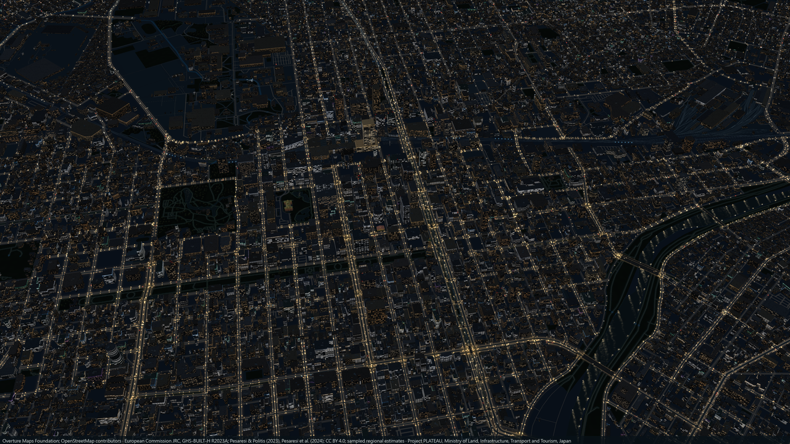
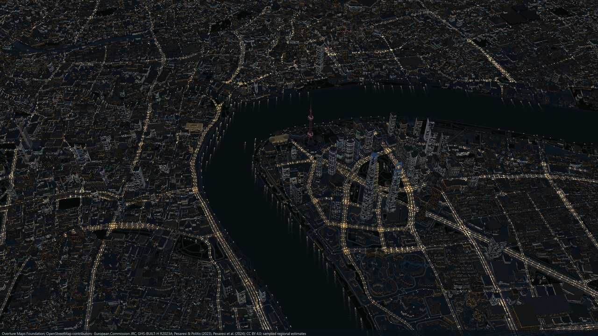
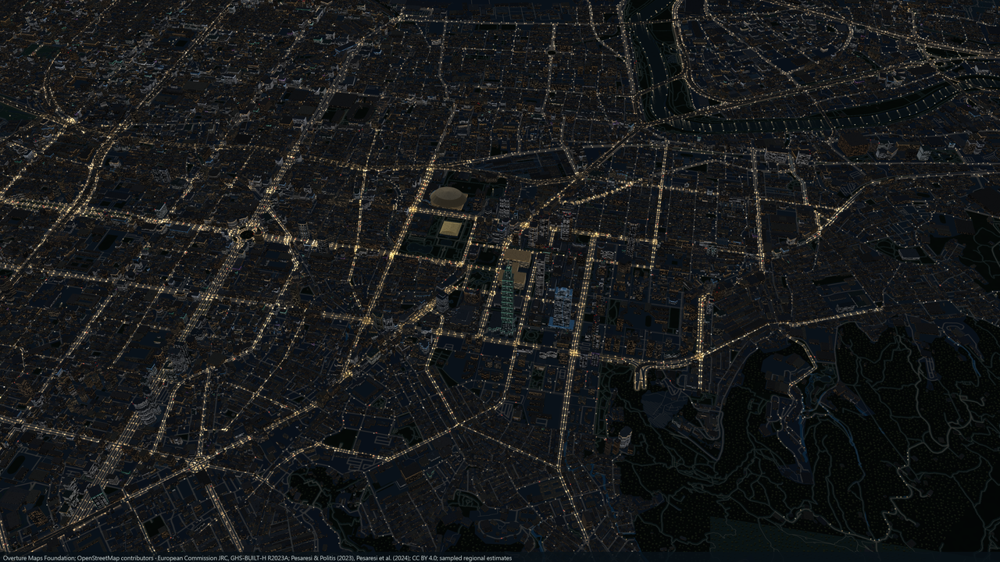
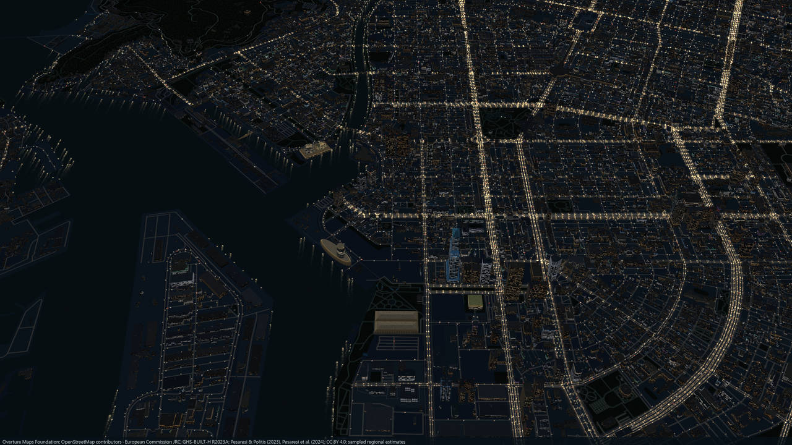
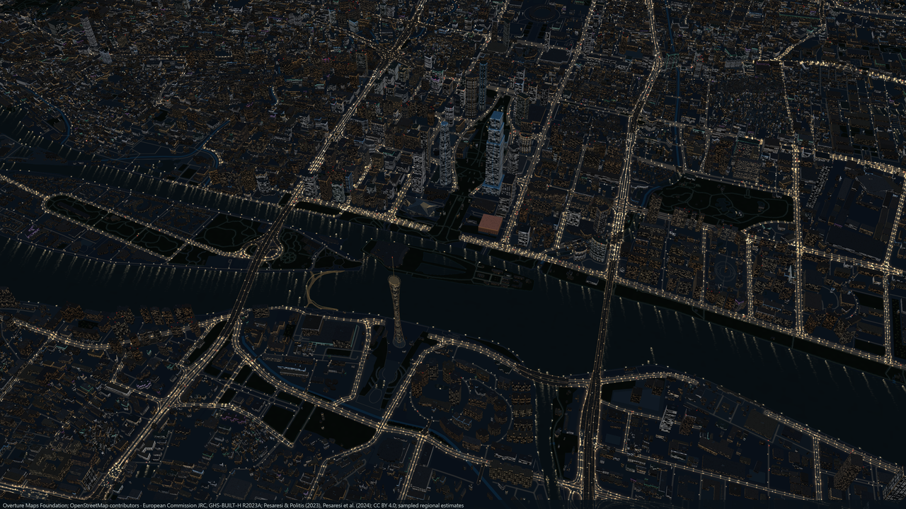
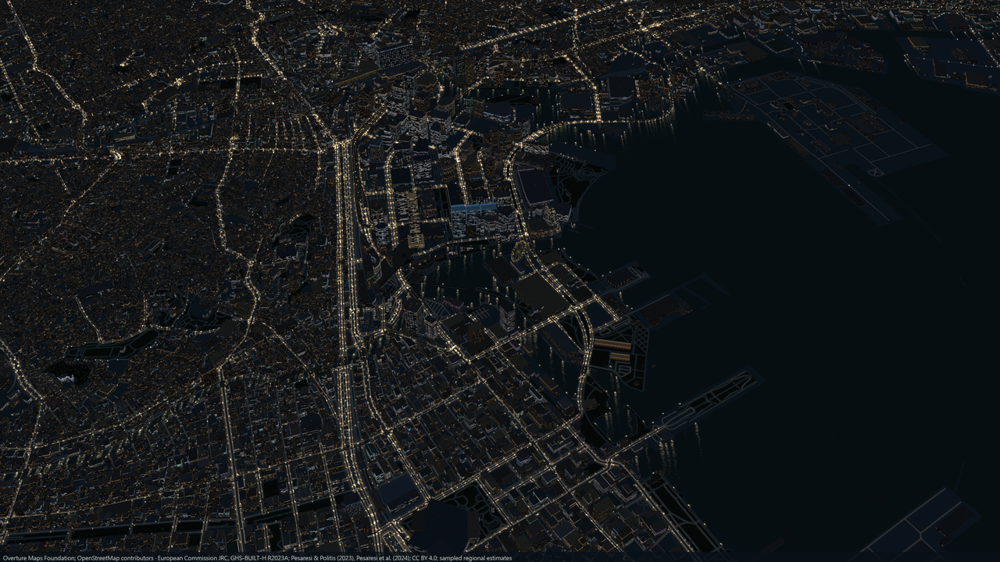
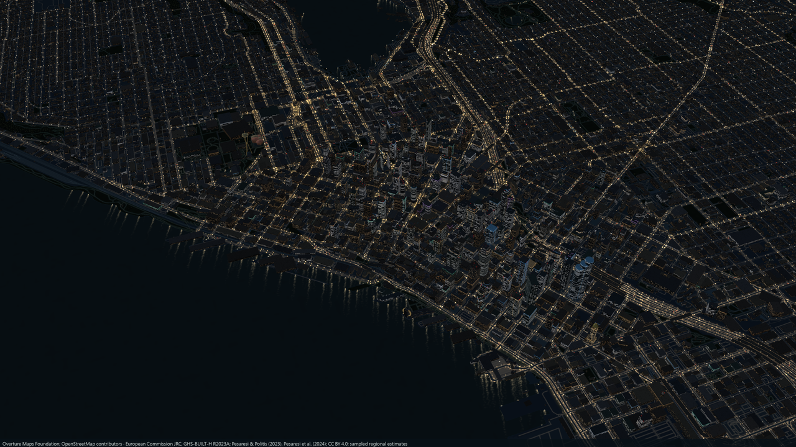
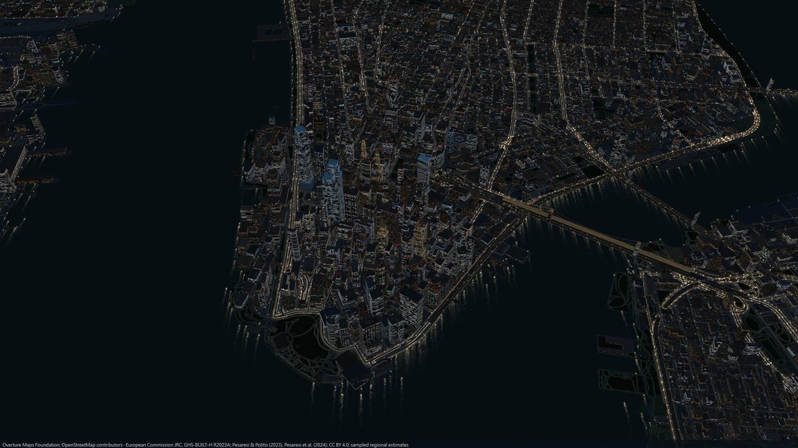

# 精選城市

[English](SHOWCASE.md) · [Gallery](https://lumenstreets.feifeihome.com/gallery.html#zh) · [文件](README.zh-TW.md)

八個起點，從棋盤街廓到水岸天際線。點圖片查看 4K 原圖，或開啟城市自行探索。「設定 → 地標名稱」可顯示附近建築名稱。

## 札幌・大通

大通公園周圍，明亮街道展開成棋盤格。 [探索這個城市](https://lumenstreets.feifeihome.com/?city=sapporo&lang=zh-TW)

**周邊地標：** 札幌電視塔、JR Tower、札幌時計台、北海道廳舊本廳舍。

## 上海・黃浦江

浦東高樓隔著深色江面，與外灘相望。 [探索這個城市](https://lumenstreets.feifeihome.com/?city=shanghai&lang=zh-TW)

**周邊地標：** 上海中心大廈、上海環球金融中心、金茂大廈、東方明珠、上海國際會議中心、外灘海關大樓、和平飯店。

## 台北・信義

台北 101 俯瞰信義區的大道與廣場。 [探索這個城市](https://lumenstreets.feifeihome.com/?city=xinyi&lang=zh-TW)

**周邊地標：** 台北 101、南山廣場、臺北大巨蛋、國父紀念館、臺北市政府。

## 高雄・愛河灣

港灣燈光沿水面延伸，85 大樓立於岸邊。 [探索這個城市](https://lumenstreets.feifeihome.com/?city=kaohsiung&lang=zh-TW)

**周邊地標：** 85 大樓、高雄流行音樂中心高低塔、高雄港旅運中心、高雄展覽館、高雄市立圖書館總館、大港橋。

## 廣州・珠江新城

廣州塔與珠江新城分立兩岸，江面保留開闊的暗部。 [探索這個城市](https://lumenstreets.feifeihome.com/?city=guangzhou&lang=zh-TW)

**周邊地標：** 廣州塔、廣州國際金融中心、廣州周大福金融中心、廣州歌劇院、廣東省博物館、海心橋。

## 橫濱・港未來

高樓、帆船形飯店與摩天輪勾勒港灣輪廓。 [探索這個城市](https://lumenstreets.feifeihome.com/?city=yokohama&lang=zh-TW)

**周邊地標：** 橫濱地標塔、皇后廣場三棟塔樓、帆船飯店、Cosmo Clock 21、橫濱海洋塔、紅磚倉庫兩館。

## 西雅圖・艾略特灣

市中心街道朝碼頭與艾略特灣的開闊水面延伸。 [探索這個城市](https://lumenstreets.feifeihome.com/?city=seattle&lang=zh-TW)

**周邊地標：** 太空針塔、Columbia Center、Smith Tower、Rainier Tower、中央圖書館、Seattle Great Wheel、MoPOP。

## 紐約・下曼哈頓

密集天際線被兩側河面環繞，布魯克林大橋橫跨東側。 [探索這個城市](https://lumenstreets.feifeihome.com/?city=newyork&lang=zh-TW)

**周邊地標：** 世貿一號、三號、四號、30 Park Place、Woolworth、70 Pine、40 Wall Street、8 Spruce、Oculus、布魯克林大橋。

地標會依瀏覽範圍出現。完整定位與來源見[模型目錄](../src/three/showcase-landmarks.json)，模型精度、容量與投稿方式見[地標模型](3D-LANDMARKS.zh-TW.md)。

圖片由 Lumen Streets 匯出。地圖資料 © [OpenStreetMap contributors · ODbL](https://www.openstreetmap.org/copyright)、[Overture Maps](https://docs.overturemaps.org/attribution/)；高度來源見[來源與授權](../ATTRIBUTION.md)。
